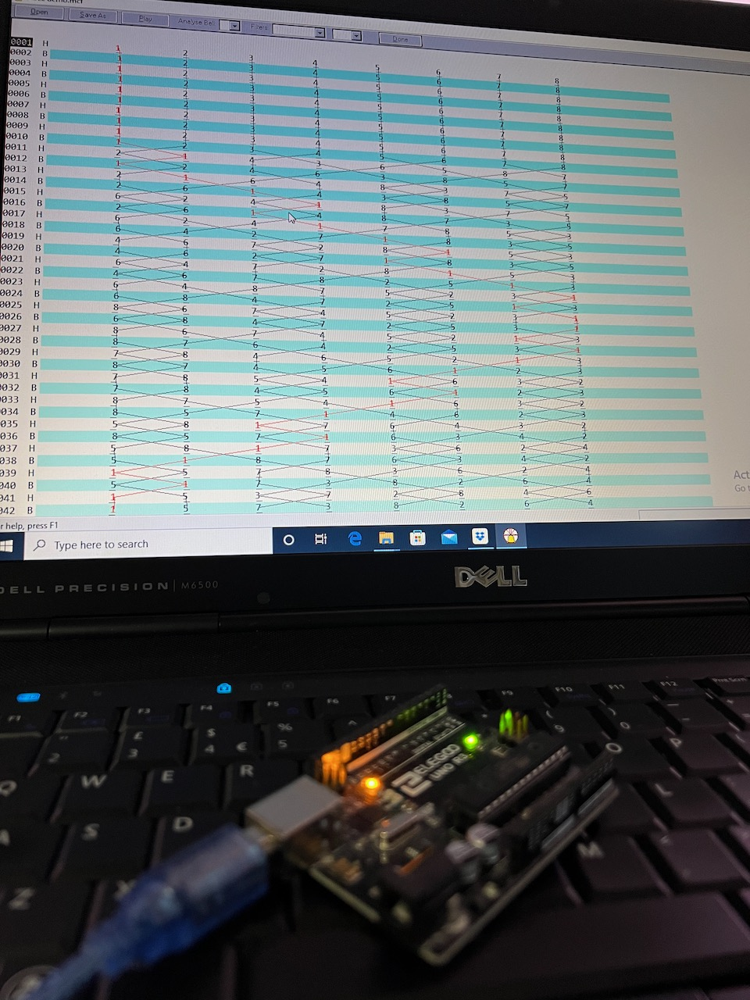
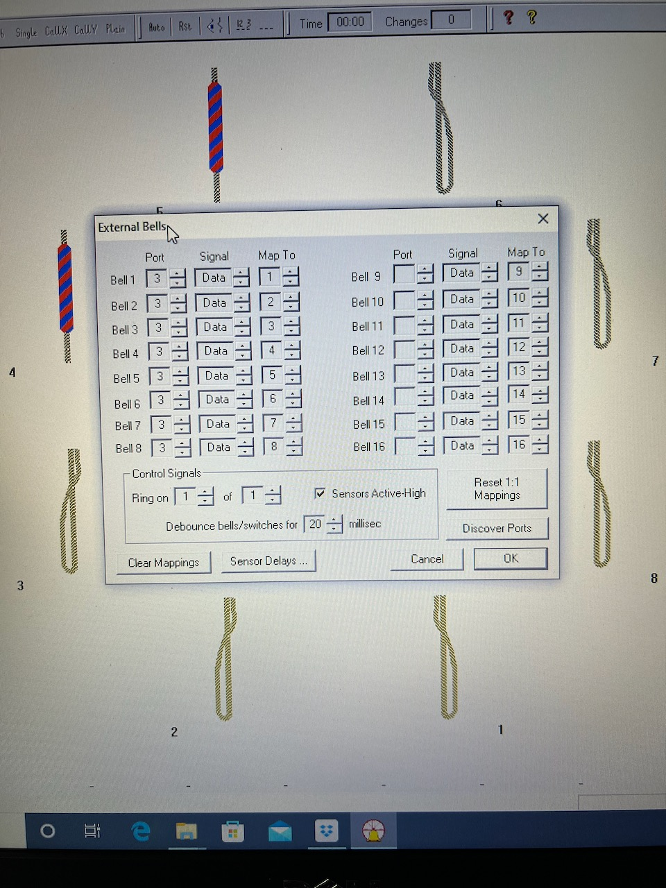

# Multi-bell Interface Simulator

Multi-Bell Interfaces such as the ones produced by [David
Bagley](http://www.bagleybells.co.uk) allow computers to interface
with tower bell installations via RS-232.

This project uses an Arduino Uno to emulate such devices allowing
hardware/software to be developed away from the ringing room.

As uploaded, the Arduino will output a 1344 change composition of
[Yorkshire Surprise Major](https://complib.org/method/17060) in
around 45 minutes.  Bells are spaced at 250ms with a handstoke gap.

The method, types of call can be configured at the beginning of the
file using standard place notation.  The composition given as a
sequence of leads, ' ' for a plain lead, '-' for a bob and 's' for
a single.

```
const char *method = "-38-14-58-16-12-38-14-78,12";  // Yorkshire
const size_t lead_length = 32;                       // Surprise
const uint8_t stage = 8;                             // major
const char *bob = "14";
const char *single = "1234";
const size_t call_at = lead_length - 1;
const char *composition = "     -  -   -      -  -   -      -  -   - ";   // 1344 Yorkshire Surprise Major
```

The Arduino can be connected directly to a computer running [Abel](http://www.abelsim.co.uk):



Under Options \ External Bells using _Discover Ports_ to detect the
COM port which the Arduino is emulating.  In my case, `COM3` is
used so I have set _Port_ to 3, _Signal_ to _Data_, and _Map To_
to 1 through 8.



